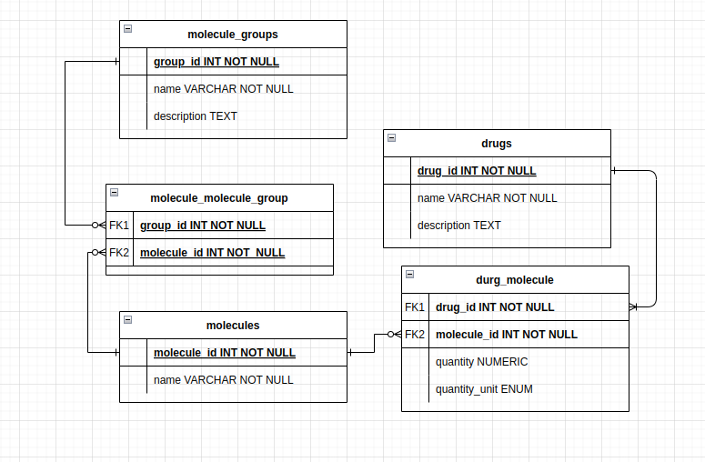

# Current Progress Overview

Currently main routes include:

- `/molecules` 
- `/drugs` 

These routes support basic CRUD operations(drugs is missing update).

Additionally, molecules support substructure search and file upload.

Everything is synchronous.

# Database Schema

Molecule groups are not implemented yet.

# API Documentation

Get all routes support pagination with `page` and `pageSize` query parameters.

There are certain kind of operations, for which just getting a certain number of results makes more
sense than paginating through all results. 
When you encounter a `limit` query parameter, it is used to limit the number of results returned.

You will see `Links` object in the response body, which contains links to related resources, 
and it is used for HATEOAS.

HATEOAS is implemented as a dictionary of links, where the key is the relation type, 
and the value is a dictionary containing the `href` and `method` fields. These links come
with the response body, and they are used to navigate through the API.

HATEOAS is not fully implemented. You can not get every kind of operation available for a resource,
you just get the most useful ones. For example self, superstructures, substructures links are provided for molecules.
If you want to update a molecule, you will just send a PUT request to the self link.

## Molecules  

Endpoints and DTO for molecules.

### Endpoints `/molecules`

I decided to support both substructure and superstructure search.

Here the term `superstructure` refers to a molecule that the given molecule is a substructure of.
For example, if `C` is a substructure of `CC`, then `CC` is a superstructure of `C`.

I am not sure if this is the correct terminology, but it is the most simple and intuitive way
I can describe it. 

    - POST: Create a new molecule

    - DELETE: /{molecule_id} Delete a molecule by id

    - PUT: /{molecule_id} Update a molecule by id

    - POST: /upload Upload a csv file containing molecules info

    - GET: /{molecule_id} Get a molecule by id

    - GET: /?page={page}&pageSize={pageSize}&name={name}&minMass={minMass}&maxMass={maxMass}

    - GET: /search/substructures?smiles={smiles}?limit={limit} Search for a molecule by substructure
    
    - GET: /search/superstructures?smiles={smiles}?limit={limit} Search for a molecule by superstructure

### Molecule DTOs

These are the data transfer objects, used for request and response bodies.

You can see data types as well as examples for each field.

##### MoleculeRequest: Request body for creating a molecule

    - name: string `Methane`
    - smiles: string `C`

##### MoleculeResponse: Response body for a molecule
 
    
    - id: int `1`
    - name: string `Methane`
    - smiles: string `C`
    - mass: float `16.04`
    - links: dict[string, Link] `{
        
        self: {
            href: molecules/{id}
            method: GET
        }

         superstructures: {
            href: molecules/search/superstructures?smiles={smiles}
            method: GET
        }

        substructures: {
            href: molecules/search/substructures?smiles={smiles}
            method: GET
        }
        
    }`

##### MoleculeCollectionResponse: Response body for a collection of molecules

Pay attention, if this is a response from substances search, you will not see pagination attributes
page, pageSize, and links will be empty.

    - total: int `100`
    - page: Optional[int] `1`
    - pageSize: Optional[int] `10`
    - data: List[MoleculeResponse]
    - links: dict[string, Link] `{
        
        nextPage: {
            href: molecules/?page=2&pageSize=10
            method: GET
        }
    
        prevPage: {
            href: molecules/?page=1&pageSize=10
            method: GET
        }

    }`
    
    

