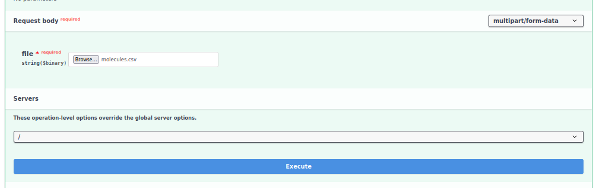
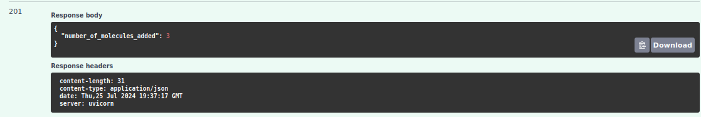
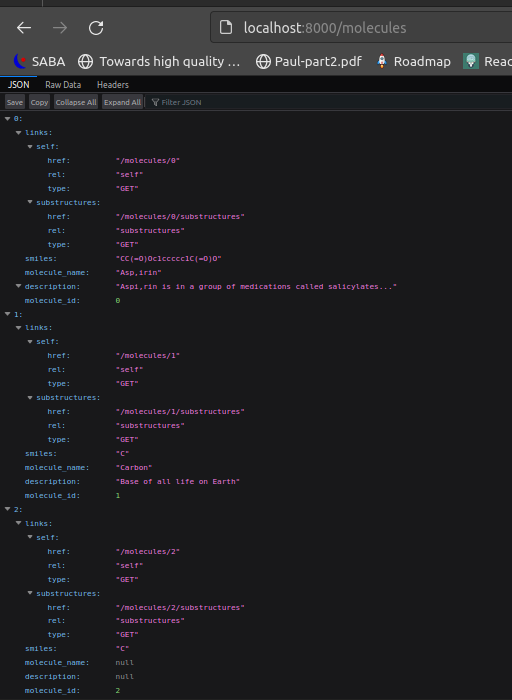

## Molecule Model

I've created the Molecule model, which will be the only model stored. Apart from the required `smiles` and `id` attributes, I've added optional `name` and `description` attributes to make things a bit more interesting.
I decided to have integer auto generated ids. This works by having a class variable `__next_id`.
I've also added a property `molecule_id` to make the id read-only.
### Code Implementation

```python
class Molecule:
    __next_id = 0

    def __init__(self, smiles: str, molecule_name: str | None = None, description: str | None = None):
        self._molecule_id: int = Molecule.__next_id
        Molecule.__next_id += 1
        self.molecule_name: str = molecule_name
        self.smiles: str = smiles
        self.description: str | None = description

    @property
    def molecule_id(self) -> int:
        return self._molecule_id
```


## Endpoints

I've decided to have the following endpoints:

/molecules

/molecules/{molecule_id}

/molecules/{molecule_id}/substructures

/upload_molecules_csv


## Resource representation

I've decided to have the following request representations. They extend the `BaseModel` class from the `pydantic` module.

First we have the model for adding and updating a molecule. It does not require the `molecule_id` attribute, as it is 
auto generated and read-only.

### AddMoleculeRequest

```python
class AddMoleculeRequest(BaseModel):
    smiles: str
    molecule_name: str | None = None
    description: str | None = None


    @field_validator("smiles")
    def validate_smiles(cls, smiles: str) -> str:
        return utils.validate_smiles(smiles)

    model_config = {
        "json_schema_extra": {
            "examples": [
                {
                    "smiles": "CC(=O)Oc1ccccc1C(=O)O",
                    "molecule_name": "Aspirin",
                    "description": "Aspirin is in a group of medications called salicylates... so on and so forth."
                }
            ]
        }
    }
```

It makes sense to validate the SMILES string before storing. I search for common custom validation in fastapi and found
`field_validator` decorator. I have added a class method `validate_smiles` to validate the SMILES string. I created the validation function
in the `utils` module. I've also added a `model_config` class variable to provide an example of the request body.


### MoleculeResponse

I tried to follow the HATEOAS principle, namely JSON Hypermedia API Language (HAL).
So first I defined the pydantic models:

```python
class Link(BaseModel):
    href: str
    rel: str
    type: str


class HATEOASResponse(BaseModel):
    links: dict[str, Link]
```

Then I defined the `MoleculeResponse` model, which should have id attribute
and links to the molecule itself and its substructures. 

I added example data to the `model_config` class variable here as well.


```python
class MoleculeResponse(AddMoleculeRequest, HATEOASResponse):
    molecule_id: int
    links: dict[str, Link] = {}

    model_config = {
        "json_schema_extra": {
            "examples": [
                {
                    "molecule_id": 1,
                    "smiles": "CC(=O)Oc1ccccc1C(=O)O",
                    "molecule_name": "Aspirin",
                    "description": "Aspirin is in a group of medications called salicylates... so on and so forth."
                }
            ]
        }
    }
```

But it should be possible to easily map the request to the Molecule model, and 
the molecule model to the response. I did not research fastapi mappers, I just created static methods:

### Mapping from AddMoleculeRequest to Molecule

To acheive this, I added a static method `from_add_molecule_request` to the `Molecule` class.

```python
class Molecule:

    # ..... rest of the class
    
    @property
    def molecule_id(self) -> int:
        return self._molecule_id

    @staticmethod
    def from_add_molecule_request(add_molecule_request: AddMoleculeRequest) -> 'Molecule':
        """
        :param AddMoleculeRequest:
        :return Molecule:
        """
        return Molecule(smiles=add_molecule_request.smiles, molecule_name=add_molecule_request.molecule_name,
                        description=add_molecule_request.description)

    # ..... rest of the class
```


### Mapping from Molecule to MoleculeResponse

I added a static method `from_molecule` to the `MoleculeResponse` class.

```python
class MoleculeResponse(AddMoleculeRequest, HATEOASResponse):
    # ..... attributes
    
    @staticmethod
    def from_molecule(molecule: 'Molecule') -> 'MoleculeResponse':
        links = {
            "self": Link(
                href=f"{BASE_URL}/molecules/{molecule.molecule_id}",
                rel="self",
                type="GET"
            ),
            "substructures": Link(
                href=f"{BASE_URL}/molecules/{molecule.molecule_id}/substructures",
                rel="substructure_search",
                type="GET"
            )
        }

        return MoleculeResponse(molecule_id=molecule.molecule_id, smiles=molecule.smiles,
                                molecule_name=molecule.molecule_name, description=molecule.description, links=links)

    #..... rest of the class
```

## Molecules Repository

Just because I love OOP and inheritance and polymorphism, and I come from Java background,
I decided to create a class Repository, which will be the interface data structure for storing molecules.
It will have all the necessary methods for crud operations.

I made this class generic: type `KEY` for the id and type `VAL` for the value, because it will be 
key-value storage. 

I acheived this by using the `Generic` and `TypeVar` from the `typing` module. 

### MoleculesRepository interface

```python

KEY = TypeVar('KEY')
VAL = TypeVar('VAL')


class Repository(ABC, Generic[KEY, VAL]):

    @abstractmethod
    def find_by_id(self, molecule_id: KEY) -> VAL | None:
        pass

    @abstractmethod
    def find_all(self) -> list[VAL]:
        pass

    @abstractmethod
    def exists_by_id(self, obj_id: KEY) -> bool:
        pass

    @abstractmethod
    def add(self, obj: VAL) -> VAL:
        pass

    @abstractmethod
    def delete_by_id(self, obj_id: KEY) -> None:
        pass

    @abstractmethod
    def clear(self) -> None:
        pass
```

### MoleculesRepository implementation

This implementation uses dictionary as the data structure for storing molecules. Pretty simple.

```python
class InMemoryMoleculesRepository(Repository[int, Molecule]):

    def __init__(self):
        self._molecules: dict[int, Molecule] = {}

    def find_by_id(self, molecule_id: int) -> Molecule | None:
        return self._molecules.get(molecule_id, None)

    def find_all(self) -> list[Molecule]:
        return list(self._molecules.values())

    def exists_by_id(self, molecule_id: int) -> bool:
        return molecule_id in self._molecules

    def add(self, molecule: Molecule) -> Molecule:
        if self.exists_by_id(molecule.molecule_id):
            raise ValueError(f"Molecule with id {molecule.molecule_id} already exists")
        self._molecules[molecule.molecule_id] = molecule
        return molecule

    def delete_by_id(self, molecule_id: int) -> None:
        if molecule_id in self._molecules:
            del self._molecules[molecule_id]
        else:
            raise ValueError(f"Molecule with id {molecule_id} does not exist")

    def clear(self) -> None:
        self._molecules.clear()
```

I want to draw attention to the find_all method. It returns a list of molecules in the order they were added.
This is because dictionaries in Python 3.7+ are ordered. If this was not the case, then it might have caused
some inconsistencies for the endpoins that use pagination(skip:limit).


## Exceptions and Error Handling

I defined two custom exceptions: `UnknownIdentifierException` and `InvalidSmilesException`, that were the most
relevant for the application. I defined custom handlers for these exceptions in the `main` module.

```python
class UnknownIdentifierException(Exception):
    def __init__(self, identifier: int):
        self.identifier = identifier
        super().__init__(f"Unknown identifier: {identifier}")

```
UnknownIdentifierException is raised when the requested molecule id will not be found in the repository.
When this exception is raised, the response status code should be 404. Also, the response body should contain the
error message.

```python
@app.exception_handler(exception.InvalidSmilesException)
def invalid_smiles_exception_handler(request, exc):
    return JSONResponse(status_code=status.HTTP_400_BAD_REQUEST, content={"detail": str(exc)})
```


```python  

class InvalidSmilesException(Exception):
    def __init__(self, smiles: str):
        self.smiles = smiles
        super().__init__(f"Invalid SMILES string: {smiles}")
```

InvalidSmilesException is raised when the SMILES string is not valid. When this exception is raised, 
the response status code should be 400. Also, the response body should contain the error message.

```python
@app.exception_handler(exception.UnknownIdentifierException)
def unknown_identifier_exception_handler(request, exc):
    return JSONResponse(status_code=status.HTTP_404_NOT_FOUND, content={"detail": str(exc)})
```


## Endpoints Implementation

I initialized FastAPI, InMemoryMoleculesRepository, and the custom exceptions handlers in the `main` module.

```python
app = FastAPI()
molecules_repository: Repository[int, Molecule] = InMemoryMoleculesRepository()
```

Then I implemented the endpoints. I documented them with the OpenAPI specification as much as possible. Implementations
are pretty straightforward. I used Annotated for all the parameters, as it is was said to be the best practice in the
FastAPI documentation.

What I don't like now is that when using skip and limit parameters, whole list of molecules is fetched from the 
memory anyway. I would not have done that if the sole purpose of this project was to learn FastAPI stuff.
But that could be easily changed by using some kind of pagination in the repository.

Also what I did is to make the query parameter `limit` required. Way I am ignoring it is if it equals to 0 - 
it's default value.

### Uploading Files

I've added the separate endpoint for uploading a CSV file with molecules. CSV file with the following columns: `smiles`, `molecule_name`, `description`.
should be uploaded. Uploaded files are parsed and added to the repository. Behaviour is in the pydocs, what I dont like
is indicated in the comment.

I used UploadFile as it was recommended in the documentation. It had many options like uploading in chunks, 
but I did not use them. I just read the whole file
into memory. 

This is the only asynchronous endpoint in the application. I avoided using async/await in the other endpoints, 
because I don't understand it well yet. But for this function, I had to use await when reading the contents of the file.
(actually I could have used `file.file` instead of `await file.read()` but anyways) 


```python
@app.post("/upload_molecules_csv", status_code=status.HTTP_201_CREATED)
async def upload_molecules(file: UploadFile):
    """
    Upload a CSV file containing molecules to the repository.

    Uploaded CSV file is not stored on the server, only the molecules are extracted and stored in the memory.

    The CSV file should have the following columns: smiles,name,description

    Lines that have incorrect format, missing smiles string or invalid smiles string are ignored.

    :param file:

    :return: A dictionary containing the key: number_of_molecules_added

    :raises HTTPException: If the file is not a CSV file, or does not have the required columns.
    """

    if file.content_type != "text/csv":
        raise HTTPException(status_code=status.HTTP_400_BAD_REQUEST, detail="File must be a CSV file")

    contents = await file.read()

    csv_data = contents.decode("utf-8")
    # if the first line is not smiles,name,description raise an exception
    # this is a very naive check, because more correct way would be to check column names, because
    # the order of the columns might be different, or there might be more columns
    # TODO: change this check to a better one
    if not csv_data.startswith("smiles,name,description"):
        raise HTTPException(status_code=status.HTTP_400_BAD_REQUEST, detail="CSV file should have the following "
                                                                            "columns: smiles,name,description")

    number_of_molecules_added = 0

    csv_reader = csv.DictReader(csv_data.splitlines())
    for row in csv_reader:
        try:
            validate_smiles(row["smiles"])
            molecule = Molecule(smiles=row["smiles"], molecule_name=row["name"], description=row["description"])
            molecules_repository.add(molecule)
            number_of_molecules_added += 1
        except exception.InvalidSmilesException:
            # log somewhere. just printing this time, I have not looked into logging in FastAPI yet.
            print(f"Invalid SMILES string: {row['smiles']}")

    return {"number_of_molecules_added": number_of_molecules_added}
```

## Testing

### Testing the file upload

I created a generate.py script that generates a CSV file with molecules. It has all the explanation of the
what lines it generates and what are expected to happen, which lines will be parsed and which will not. Then upload it 
using openapi. Here is the manual test and result: 
Upload the ./molecules.csv Only 3 lines should be parsed successfully:



here is the response



And now lets make the get request if those molecules are correclty uploaded:



Yes it works

### Testing Repository
I used pytest to test InMemoryMoleculesRepository. I tested all the methods. I used the @fixture decorator to create
a repository instance for each test.

### Testing Endpoints

I used fastapi.testclient to test the endpoints. For this it is important to have httpx installed. 

I like the tests I wrote it helped a lot, but  I could not mock the repository in the tests.
 I just imported the repository from the main file in the tests.
 Before each test, I cleared the repository.
 I know it is not a good practice, but I could not find a better way for now.

